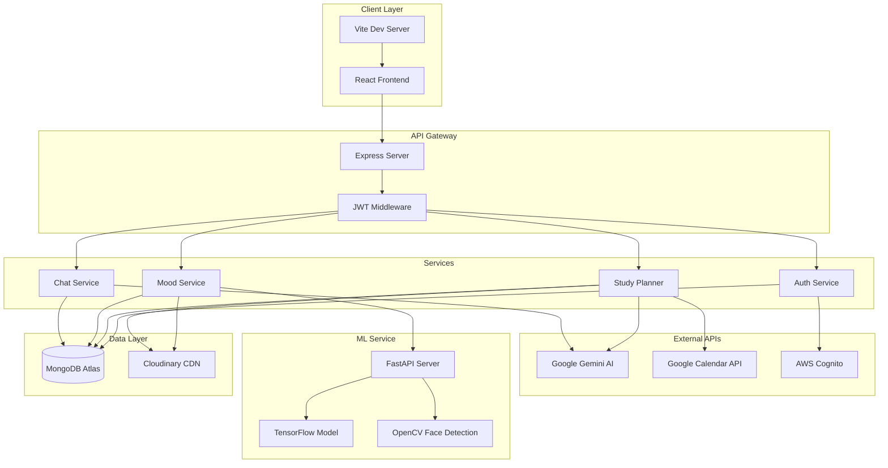

# 🌊 MindHarbor

<div align="center">


**Your Safe Space for Mental Wellness**

[](https://reactjs.org/)
[](https://nodejs.org/)
[](https://www.mongodb.com/)
[](https://www.python.org/)
[](https://www.tensorflow.org/)
[](https://aws.amazon.com/)

_A comprehensive mental health platform powered by AI and machine learning_

[Features](#-features) • [Tech Stack](#-tech-stack) • [Getting Started](#-getting-started) • [Architecture](#-architecture) • [Demo](#-demo)

</div>

---

## 📖 Table of Contents

- [Overview](#-overview)
- [Key Features](#-key-features)
- [Tech Stack](#-tech-stack)
- [System Architecture](#-system-architecture)
- [Installation & Setup](#-installation--setup)
- [Project Structure](#-project-structure)
- [API Documentation](#-api-documentation)
- [Screenshots](#-screenshots)
- [Future Enhancements](#-future-enhancements)
- [Team](#-team)
- [License](#-license)

---

## 🌟 Overview

**MindHarbor** is an innovative mental health and wellness platform designed to provide comprehensive support for students and individuals struggling with stress, anxiety, and emotional challenges. By combining cutting-edge AI technology, real-time emotion detection, and personalized resources, MindHarbor creates a safe, accessible space for mental wellness.

### 🎯 Problem Statement

Mental health challenges among students are at an all-time high, yet access to professional support remains limited. MindHarbor bridges this gap by offering:

- 24/7 AI-powered emotional support
- Real-time mood tracking with facial emotion recognition
- Professional counselor booking system
- Academic planning tools to reduce stress

---

## ✨ Key Features

### 🤖 AI Chat Companion

- **Google Gemini-Powered**: Intelligent conversational AI trained for empathetic mental health support
- **Context-Aware**: Understands mood context and provides personalized responses
- **Session Management**: Persistent chat history with mood-based session tracking
- **Crisis Detection**: Automatic detection of crisis keywords with emergency resource links
- **Multi-Session Support**: Create and manage multiple conversation threads

### 📸 AI-Powered Mood Detection

- **Real-Time Emotion Recognition**: Uses TensorFlow-trained CNN model for facial emotion analysis
- **7 Emotion Categories**: Detects Happy, Sad, Angry, Fear, Disgust, Surprise, and Neutral
- **Confidence Scoring**: Provides accuracy metrics for each detection
- **Auto-Logging**: Automatically saves detected emotions to your mood journal
- **Camera Integration**: Seamless webcam integration with privacy controls

### 📊 Comprehensive Mood Tracking

- **Historical Analysis**: Track your emotional patterns over days, weeks, and months
- **Visual Analytics**: Beautiful charts and graphs showing mood trends
  - Weekly Intensity Bar Charts
  - Emotional Trends Line Graphs
  - Daily Mood Distribution
- **Manual Logging**: Quick mood entry with notes and context
- **Recent Activity Timeline**: View your mood history at a glance
- **Export Data**: Download your mood data for personal records

### 🎓 Smart Study Planner

- **AI-Generated Study Plans**: Create personalized study schedules using Google Gemini
- **Syllabus Upload**: Upload course syllabus (images/PDFs) and get an optimized study plan
- **Calendar Integration**: Sync with Google Calendar for seamless scheduling
- **Task Management**: Track study sessions and assignments
- **Stress-Aware Scheduling**: Considers workload to prevent burnout

### 👨‍⚕️ Counselor Booking System

- **Professional Directory**: Browse qualified mental health counselors
- **Calendar Integration**: Check real-time availability
- **Booking Management**: Schedule and manage appointments
- **Confirmation System**: Receive booking confirmations and reminders

### 📈 Analytics Dashboard

- **Personalized Insights**: Understand your mental health patterns
- **Mood Score Tracking**: See your overall emotional well-being score
- **Trend Visualization**: Identify patterns and triggers
- **Progress Monitoring**: Track improvements over time
- **Daily Mood Cards**: Quick check-ins with AI chat integration

### 🔐 Secure Authentication

- **AWS Cognito Integration**: Enterprise-grade authentication
- **Social Login**: Sign in with Google (OAuth 2.0)
- **Email Verification**: Secure account creation
- **Session Management**: Persistent login with JWT tokens
- **Password Recovery**: Secure reset functionality

### 🎨 Beautiful UI/UX

- **Modern Design**: Clean, calming interface with nature-inspired color palette
- **Responsive Layout**: Seamless experience across desktop, tablet, and mobile
- **Dark Mode Optimized**: Eye-friendly design for extended use
- **Smooth Animations**: Delightful micro-interactions
- **Accessibility**: WCAG compliant for inclusive design

---

## 🛠️ Tech Stack

### Frontend

```
├── React 19.2.0              - UI Library
├── Vite 7.3.1                - Build Tool & Dev Server
├── React Router 7.13.1       - Client-side Routing
├── Tailwind CSS 4.2.1        - Utility-First Styling
├── Recharts 3.7.0            - Data Visualization
├── Lucide React 0.575.0      - Icon Library
└── Mermaid 11.12.3           - Diagram Generation
```

### Backend

```
├── Node.js + Express 5.2.1   - Server Framework
├── MongoDB + Mongoose 9.2.3  - Database & ODM
├── AWS Cognito SDK           - Authentication
├── Google Gemini API         - AI Chat & Planning
├── Google Calendar API       - Event Scheduling
├── Cloudinary 2.9.0          - Image/File Storage
├── JWT + Cookie Parser       - Session Management
├── Axios 1.6.2               - HTTP Client
├── Express Validator 7.0.1   - Input Validation
├── Morgan + Winston          - Logging
└── Multer 2.1.0              - File Upload Handling
```

### Emotion Detection Service

```
├── Python 3.x                - Programming Language
├── FastAPI                   - Modern API Framework
├── TensorFlow 2.20.0         - Deep Learning Framework
├── OpenCV                    - Computer Vision
├── NumPy                     - Numerical Computing
├── Pillow                    - Image Processing
└── Uvicorn                   - ASGI Server
```

### Cloud & DevOps

```
├── MongoDB Atlas             - Cloud Database
├── AWS Cognito               - User Authentication
├── Cloudinary                - Media Storage & CDN
├── Google Cloud Platform     - API Services
└── Render/Vercel             - Deployment (Ready)
```

---

## 🏗️ System Architecture



### Data Flow

1. **User Authentication Flow**

   ```
   User → React → Express → AWS Cognito → JWT Token → Secure Session
   ```

2. **Mood Detection Flow**

   ```
   Camera → React → Express → FastAPI → TensorFlow Model → Emotion Result → MongoDB
   ```

3. **AI Chat Flow**

   ```
   User Message → React → Express → Google Gemini → AI Response → MongoDB (History)
   ```

4. **Study Plan Generation**
   ```
   Syllabus Upload → Cloudinary → Google Gemini → Study Plan → Google Calendar API
   ```

---

## 🚀 Installation & Setup

### Prerequisites

- Node.js (v18+ recommended)
- Python (v3.8+)
- MongoDB Atlas account
- AWS Account (Cognito)
- Google Cloud Project (Gemini & Calendar API)
- Cloudinary account

### 1. Clone the Repository

```bash
git clone https://github.com/yourusername/mindharbor.git
cd mindharbor
```

### 2. Backend Setup

```bash
cd server
npm install

# Create .env file
cp .env.example .env
```

**Environment Variables** (`.env`):

```env
# Server
PORT=5000
NODE_ENV=development

# MongoDB
MONGO_URI=your_mongodb_atlas_uri

# AWS Cognito
AWS_REGION=us-east-1
AWS_COGNITO_USER_POOL_ID=your_pool_id
AWS_COGNITO_CLIENT_ID=your_client_id
AWS_COGNITO_CLIENT_SECRET=your_client_secret
COGNITO_DOMAIN=your_cognito_domain

# Google APIs
GOOGLE_CLIENT_ID=your_google_client_id
GOOGLE_CLIENT_SECRET=your_google_client_secret
GOOGLE_REDIRECT_URI=http://localhost:5000/api/auth/google/callback
GEMINI_API_KEY=your_gemini_api_key

# Cloudinary
CLOUDINARY_CLOUD_NAME=your_cloud_name
CLOUDINARY_API_KEY=your_api_key
CLOUDINARY_API_SECRET=your_api_secret

# ML Service
ML_SERVICE_URL=http://localhost:8000/predict

# JWT
JWT_SECRET=your_jwt_secret
JWT_EXPIRES_IN=7d
```

```bash
# Start the server
npm run dev
```

### 3. Emotion Detection Service

```bash
cd emotion-detection
pip install -r requirements.txt

# Ensure model file exists
# emotion_model.keras should be in this directory

# Start the FastAPI server
python main.py
```

The ML service will run on `http://localhost:8000`

### 4. Frontend Setup

```bash
cd client
npm install

# Create .env file
cp .env.example .env
```

**Environment Variables** (`.env`):

```env
VITE_API_URL=http://localhost:5000/api
```

```bash
# Start the development server
npm run dev
```

The app will be available at `http://localhost:5173`

### 5. Access the Application

- **Frontend**: http://localhost:5173
- **Backend API**: http://localhost:5000
- **ML Service**: http://localhost:8000
- **API Docs**: http://localhost:5000/api-docs (if Swagger configured)

---

## 📁 Project Structure

```
MindHarbor/
├── client/                          # React Frontend
│   ├── public/
│   │   ├── harbor.png              # App logo
│   │   └── resource/               # Static resources
│   ├── src/
│   │   ├── assets/                 # Images, fonts, etc.
│   │   ├── components/
│   │   │   ├── chat/              # Chat components
│   │   │   │   ├── ChatBubble.jsx
│   │   │   │   ├── SuggestedPrompts.jsx
│   │   │   │   ├── TypingIndicator.jsx
│   │   │   │   └── CrisisAlert.jsx
│   │   │   ├── common/            # Reusable components
│   │   │   │   ├── Button.jsx
│   │   │   │   ├── Card.jsx
│   │   │   │   ├── Modal.jsx
│   │   │   │   └── ProgressBar.jsx
│   │   │   ├── counselor/         # Booking components
│   │   │   ├── dashboard/         # Dashboard widgets
│   │   │   ├── layout/            # Layout components
│   │   │   │   ├── Layout.jsx
│   │   │   │   ├── Sidebar.jsx
│   │   │   │   └── Topbar.jsx
│   │   │   ├── mood/              # Mood tracking
│   │   │   │   ├── CameraDetection.jsx
│   │   │   │   ├── EmotionResult.jsx
│   │   │   │   ├── MoodHistory.jsx
│   │   │   │   └── WeeklyTrend.jsx
│   │   │   └── resources/         # Resource library
│   │   ├── context/
│   │   │   └── AuthContext.jsx    # Auth state management
│   │   ├── pages/
│   │   │   ├── AIChat.jsx         # AI Chat page
│   │   │   ├── Analytics.jsx      # Analytics dashboard
│   │   │   ├── Dashboard.jsx      # Main dashboard
│   │   │   ├── Login.jsx
│   │   │   ├── Signup.jsx
│   │   │   ├── MoodTracker.jsx    # Mood tracking page
│   │   │   ├── Resources.jsx      # Resource library
│   │   │   └── StudyPlanner.jsx   # Study planner
│   │   ├── services/
│   │   │   ├── authService.js     # Auth API calls
│   │   │   ├── chatService.js     # Chat API calls
│   │   │   ├── moodService.js     # Mood API calls
│   │   │   └── plannerService.js  # Planner API calls
│   │   ├── App.jsx
│   │   └── main.jsx
│   ├── package.json
│   └── vite.config.js
│
├── server/                          # Express Backend
│   ├── src/
│   │   ├── config/
│   │   │   ├── cognito.js         # AWS Cognito setup
│   │   │   ├── database.js        # MongoDB connection
│   │   │   └── gemini.js          # Google Gemini setup
│   │   ├── controllers/
│   │   │   ├── auth.controller.js
│   │   │   ├── chatController.js
│   │   │   ├── mood.controller.js
│   │   │   └── studyPlannerController.js
│   │   ├── middleware/
│   │   │   ├── verifyToken.js     # JWT verification
│   │   │   ├── multer.middleware.js
│   │   │   ├── error.middleware.js
│   │   │   └── validate.js
│   │   ├── models/
│   │   │   ├── User.js
│   │   │   ├── Chat.js
│   │   │   ├── mood.model.js
│   │   │   ├── Session.js
│   │   │   └── StudyPlan.js
│   │   ├── routes/
│   │   │   ├── authRoutes.js
│   │   │   ├── chatRoutes.js
│   │   │   ├── mood.routes.js
│   │   │   └── studyPlannerRoutes.js
│   │   ├── services/
│   │   │   ├── geminiService.js   # AI chat logic
│   │   │   ├── googleCalendarService.js
│   │   │   ├── cloudinaryService.js
│   │   │   └── ragService.js      # RAG for chat
│   │   ├── utils/
│   │   │   ├── apiError.js
│   │   │   ├── apiResponse.js
│   │   │   └── asyncHandler.js
│   │   └── index.js               # App entry point
│   └── package.json
│
├── emotion-detection/               # ML Service
│   ├── emotion_model.keras         # Trained TensorFlow model
│   ├── haarcascade_frontalface_default.xml
│   ├── main.py                     # FastAPI app
│   ├── requirements.txt
│   └── Dockerfile
│
└── README.md                        # This file
```

---

## 📡 API Documentation

### Authentication Endpoints

#### Register User

```http
POST /api/auth/signup
Content-Type: application/json

{
  "email": "user@example.com",
  "password": "SecurePass123!",
  "fullName": "John Doe",
  "username": "johndoe"
}
```

#### Login

```http
POST /api/auth/login
Content-Type: application/json

{
  "email": "user@example.com",
  "password": "SecurePass123!"
}
```

#### Google OAuth

```http
GET /api/auth/google
```

### Mood Endpoints

#### Get Mood History

```http
GET /api/mood?page=1&limit=10
Authorization: Bearer <token>
```

#### Save Manual Mood

```http
POST /api/mood
Authorization: Bearer <token>
Content-Type: application/json

{
  "value": 3,
  "label": "Happy",
  "notes": "Had a great day!",
  "capturedVia": "manual"
}
```

#### Analyze Mood (with image)

```http
POST /api/mood/analyze
Authorization: Bearer <token>
Content-Type: multipart/form-data

file: <image_file>
```

### Chat Endpoints

#### Get Sessions

```http
GET /api/chat/sessions
Authorization: Bearer <token>
```

#### Start New Session

```http
POST /api/chat/start
Authorization: Bearer <token>
```

#### Send Message

```http
POST /api/chat/:sessionId/message
Authorization: Bearer <token>
Content-Type: application/json

{
  "message": "I'm feeling stressed about exams"
}
```

### Study Planner Endpoints

#### Create Study Plan

```http
POST /api/study-plan
Authorization: Bearer <token>
Content-Type: multipart/form-data

syllabusImage: <file>
subject: "Mathematics"
examDate: "2024-06-15"
```

#### Get Study Plans

```http
GET /api/study-plan
Authorization: Bearer <token>
```

---

## 📸 Screenshots

### Dashboard


_Beautiful, intuitive dashboard with mood tracking and quick actions_

### AI Chat Companion


_Empathetic AI companion for 24/7 emotional support_

### Mood Detection


_Real-time facial emotion recognition using advanced ML_

### Analytics


_Comprehensive mood trends and insights_

---

## 🔮 Future Enhancements

### Phase 1 (Next 3 Months)

- [ ] **Multi-language Support**: Add support for Hindi, Spanish, French
- [ ] **Voice Notes**: Record and analyze voice emotions
- [ ] **Peer Support Groups**: Connect with others facing similar challenges
- [ ] **Gamification**: Achievement badges and streaks for consistent tracking

### Phase 2 (6 Months)

- [ ] **Wearable Integration**: Sync with Fitbit, Apple Watch for biometric data
- [ ] **Therapy Worksheets**: Interactive CBT/DBT exercises
- [ ] **Video Counseling**: Built-in video call functionality
- [ ] **Family Dashboard**: Share progress with trusted family members

### Phase 3 (12 Months)

- [ ] **Research Partnerships**: Collaborate with universities for studies
- [ ] **Insurance Integration**: Connect with health insurance providers
- [ ] **Prescription Management**: Track medication and effects
- [ ] **Crisis Intervention**: Direct connection to crisis hotlines

---

## 🤝 Contributing

We welcome contributions! Please see our [Contributing Guidelines](CONTRIBUTING.md) for details.

1. Fork the repository
2. Create your feature branch (`git checkout -b feature/AmazingFeature`)
3. Commit your changes (`git commit -m 'Add some AmazingFeature'`)
4. Push to the branch (`git push origin feature/AmazingFeature`)
5. Open a Pull Request

---

## 👥 Team

- **Tushar Agarwal** - Full Stack Developer - [GitHub](https://github.com/tusharagar)
- **Vanshaj Bhardwaj** - ML Engineer
- **Vatsal Vaibhav** - Full Stack Developer

---

## 🙏 Acknowledgments

- TensorFlow team for the amazing ML framework
- Google for the powerful Gemini AI API
- AWS for reliable authentication services
- MongoDB for scalable database solutions
- The open-source community for incredible tools and libraries

---

<div align="center">

### 💙 Built with love for mental wellness

**If you find MindHarbor helpful, please consider starring ⭐ the repository!**

Made with 💙 by Team MindHarbor | Hackathon 2026

</div>
